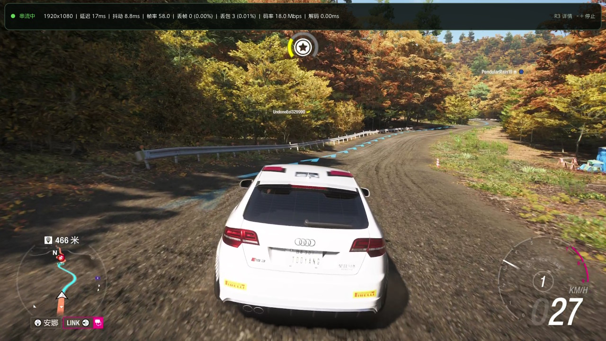

# LunarNX

English | [简体中文](README.zh-CN.md)

An unofficial Xbox Remote Play and Xbox Cloud Gaming client for Nintendo Switch homebrew.



## Highlights

- Stream games from your own Xbox console on the same local network
- Browse and play supported Xbox Cloud Gaming titles
- Choose 720p, 1080p, or 1080p HQ quality profiles
- Hardware-accelerated video, low-latency audio, controller input, and rumble
- Console discovery, wake-up, cloud library browsing, recent games, and search
- Optional image upscaling and sharpening
- Fast recovery from short packet-loss bursts and temporary network disruption
- English, Simplified Chinese, and Traditional Chinese interfaces

The current release has been tested on real Switch hardware with local console streaming and Xbox Cloud Gaming at all three quality profiles. Results still depend on the network, Xbox services, account, region, and game.

> [!WARNING]
> LunarNX is early-stage homebrew software. It requires a modified Nintendo Switch that can run NRO applications and is not compatible with an unmodified retail console.

## Compatibility

| Feature | Status |
| --- | --- |
| Xbox Remote Play on the same LAN | Tested on real Switch hardware |
| Xbox Cloud Gaming | Tested on real Switch hardware |
| 720p / 1080p / 1080p HQ | Tested with local and cloud streaming |
| Xbox Remote Play over the internet | Experimental; depends on direct network connectivity |

Remote Play over the internet does not work on every network because LunarNX does not currently provide a TURN relay fallback. Same-LAN Remote Play and Xbox Cloud Gaming are the recommended paths.

## Requirements

- A Nintendo Switch capable of running homebrew NRO applications, typically with Atmosphere CFW
- Homebrew Menu running in title-override/full-memory mode
- An Xbox One or Xbox Series console with Remote Play enabled, or an account eligible for Xbox Cloud Gaming
- A stable 5 GHz Wi-Fi or wired network connection

Xbox Cloud Gaming availability depends on account entitlement and region. Game Pass Ultimate is commonly required, although eligible free-to-play titles may differ.

## Installation

1. Download `LunarNX.nro` from the [Releases page](https://github.com/thinkzhou/LunarNX/releases).
2. Copy it to your SD card:

   ```text
   sdmc:/switch/LunarNX/LunarNX.nro
   ```

3. Open Homebrew Menu using title override, then launch LunarNX.

Do not share the contents of `sdmc:/switch/LunarNX/`. This directory can contain Microsoft/Xbox sign-in data and diagnostic logs.

## Getting Started

1. Select **Start sign-in**.
2. Open the displayed Microsoft device-login URL on a phone or computer and enter the code.
3. Choose your registered Xbox console or open the Xbox Cloud Gaming library.
4. Open Settings and select 720p, 1080p, or 1080p HQ.
5. Select **Play** or **Wake & connect**.

Start with 720p if you are unsure about network quality, then try 1080p or 1080p HQ. The first connection can take up to a minute, and a sleeping console may require another wake-up attempt.

## Controls

LunarNX maps face buttons by physical position, translating the Nintendo labels to the equivalent Xbox layout.

| Nintendo Switch | Xbox action |
| --- | --- |
| B (bottom) | A |
| A (right) | B |
| Y (left) | X |
| X (top) | Y |
| L / R | LB / RB |
| ZL / ZR | LT / RT |
| Minus | View |
| Plus | Menu |
| L + R + Plus | Xbox Guide / Nexus |
| Left stick click | L3 |
| Right stick click | R3 |
| D-pad / sticks | D-pad / sticks |

ZL and ZR are digital Switch buttons, so Xbox trigger input is reported as either 0% or 100%.

- Swipe inward from the right edge of the touch screen to open the stream menu. It contains performance information, the Xbox button, and disconnect controls.
- Press **L + R + Plus together** to open the Xbox Guide.
- To stop streaming with buttons, press **Minus + Plus together twice within three seconds**. Pressing either button alone still sends Xbox View or Menu.

## Troubleshooting

- **The app does not start:** launch Homebrew Menu with title override. Applet Mode may not provide enough memory for streaming and hardware decoding.
- **Video stutters or becomes blocky:** use 5 GHz Wi-Fi, move closer to the access point, reduce other network traffic, or try the 720p profile.
- **Your Xbox is not found:** confirm that Remote Play is enabled and that the Xbox and Switch are on the same LAN. Try waking the console and refreshing the list.
- **Internet Remote Play cannot connect:** the current connection must find a direct path through the network. Restrictive NAT or firewalls may prevent this.
- **Cloud games are unavailable:** confirm that the account and region are eligible for Xbox Cloud Gaming.

## Screenshots

| Console discovery | Stream settings |
| --- | --- |
|  |  |


## Support And Privacy

Before reporting a problem, read [SECURITY.md](SECURITY.md). Never post token files, complete logs, raw Xbox responses, console identifiers, or public IP addresses. A useful report includes the selected quality profile, Switch model and firmware, whether the session was local or cloud, network type, and only the smallest redacted log excerpt needed.

## Development

Build instructions, validation commands, architecture, and simulator testing are documented in the [development guide](docs/development.md). Contributions are welcome; see [CONTRIBUTING.md](CONTRIBUTING.md).

## Credits And License

LunarNX builds on or learns from [libpeer](https://github.com/sepfy/libpeer), [Borealis](https://github.com/XITRIX/borealis), [FFmpeg](https://github.com/FFmpeg/FFmpeg), [libnx](https://github.com/switchbrew/libnx), [deko3d](https://github.com/devkitPro/deko3d), [XStreaming](https://github.com/Geocld/XStreaming), [Greenlight](https://github.com/unknownskl/greenlight), [Moonlight-Switch](https://github.com/XITRIX/Moonlight-Switch), [wiliwili](https://github.com/xfangfang/wiliwili), [libnxbox](https://github.com/ursusworks/libnxbox), and [xbox-xcloud-player](https://github.com/unknownskl/xbox-xcloud-player).

LunarNX-owned source code is licensed under the [MIT License](LICENSE). Third-party source, libraries, patches, and linked release artifacts remain subject to their own licenses; see [THIRD_PARTY_NOTICES.md](THIRD_PARTY_NOTICES.md).

LunarNX is not affiliated with, authorized by, or endorsed by Microsoft, Xbox, Nintendo, or the maintainers of the referenced projects. All product names and trademarks belong to their respective owners.
