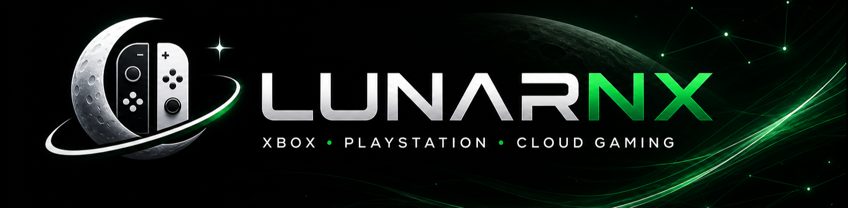
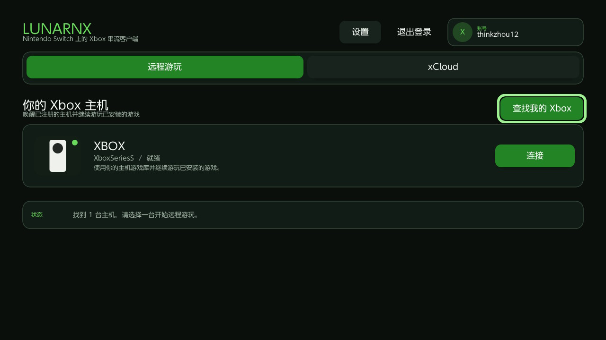
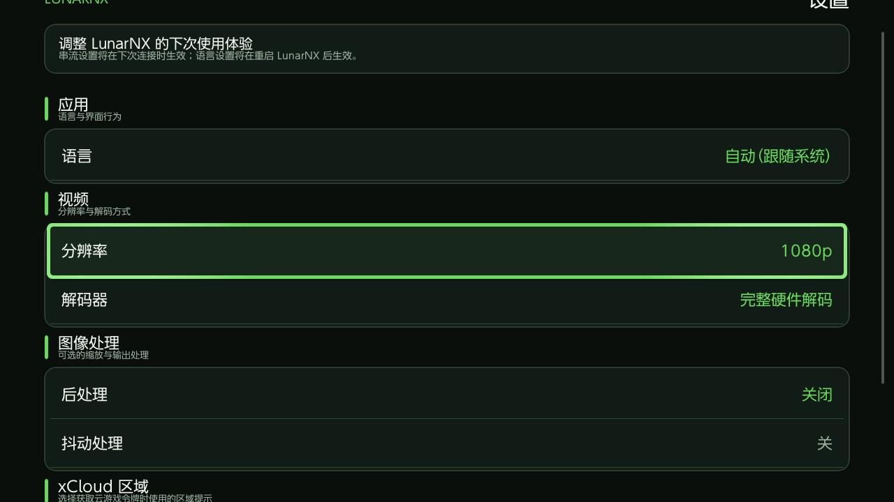
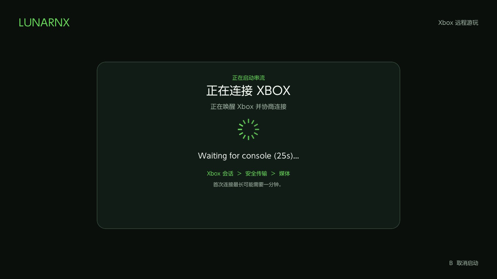

# LunarNX

[English](README.md) | 简体中文



面向 Nintendo Switch 自制软件环境的非官方 Xbox 与 PlayStation 游戏串流客户端。

LunarNX 将 Xbox Remote Play、Xbox Cloud Gaming 和 PlayStation Remote Play 整合到一款以手柄操作为核心的 Switch 应用中。

**请从 [GitHub Releases](https://github.com/thinkzhou/LunarNX/releases/latest) 下载最新版本。**

## 项目亮点

- 串流自己的 Xbox One 或 Xbox Series 主机
- 浏览、搜索并游玩 Xbox Cloud Gaming 游戏
- 支持已配对 PS4 和 PS5 的 PlayStation Remote Play
- PlayStation 局域网发现、配对、唤醒与串流
- 登录 PlayStation Network、发现账号中的 PS5，并通过 PSN 进行远程串流
- Xbox 与 PlayStation 共用 720p、1080p 和 1080p HQ 画质配置
- 硬件 H.264 与 PS5 HEVC 视频解码、低延迟音频与高频手柄输入
- Xbox 与 PlayStation 独立按键映射，支持组合键
- PlayStation 触摸板手势与 Switch 六轴体感转发
- 将 PlayStation 震动与 DualSense 触觉反馈转发为 Switch 手柄震动
- 串流性能监控、平台 Home/Guide 按钮和安全退出菜单
- 从 HOME 菜单返回后自动恢复串流会话
- 可选的画面放大与锐化
- 英文、简体中文和繁体中文界面

Xbox 本地 Remote Play、Xbox Cloud Gaming，以及通过 PSN 连接 PS5 的 Remote Play 均已在真实 Nintendo Switch 硬件上完成测试。PlayStation 串流已经能够持续输出画面、声音并响应手柄输入。PS4/PS5 局域网能力已经实现，但仍需要覆盖更多主机型号、系统版本和网络环境。

> [!WARNING]
> LunarNX 仍处于早期开发阶段。它需要能够运行 NRO 的改装 Nintendo Switch，无法在未经修改的零售版主机上运行。

## 支持情况

| 功能 | 状态 |
| --- | --- |
| 同一局域网内的 Xbox Remote Play | 已在真实 Switch 硬件上测试 |
| Xbox Cloud Gaming | 已在真实 Switch 硬件上测试 |
| 通过 PlayStation Network 连接 PS5 | 已在真实 Switch 硬件上测试 |
| PS5 局域网发现、配对、唤醒与串流 | 已实现，仍需更多实机覆盖 |
| PS4 局域网发现、配对、唤醒与串流 | 已实现，仍需更多实机覆盖 |
| 720p / 1080p / 1080p HQ | Xbox 与 PlayStation 会话均可选择 |
| 通过互联网连接自己的 Xbox | 实验性，需要网络能够建立直连 |

远程串流仍会受到账号权限、主机设置、NAT、Sony/Microsoft 服务状态和网络质量影响。在某个网络中成功连接，并不代表所有网络都能正常使用。

## 使用要求

- 能够运行 Homebrew NRO 的 Nintendo Switch，通常需要 Atmosphere CFW
- 以 Title Override / 完整内存模式运行 Homebrew Menu
- 稳定的 5 GHz Wi-Fi 或有线网络

Xbox 功能需要：

- 已启用远程功能的 Xbox One 或 Xbox Series 主机，或者
- 具备 Xbox Cloud Gaming 权限的 Microsoft 账号

PlayStation 功能需要：

- 已启用 Remote Play 的 PS4 或 PS5
- 首次本地注册时由主机生成的配对 PIN
- 通过 PSN 发现和远程连接 PS5 时使用的 PlayStation Network 账号

Xbox Cloud Gaming 的可用性取决于账号权限和地区。PlayStation 远程连接取决于主机、PSN 账号、NAT 和网络环境。

## 安装

1. 从 [Releases 页面](https://github.com/thinkzhou/LunarNX/releases) 下载最新 ZIP 或 NRO；正式版文件名可能包含版本号。
2. 将应用安装到以下路径：

   ```text
   sdmc:/switch/LunarNX/LunarNX.nro
   ```

   如果下载 ZIP，请解压其中的 LunarNX 目录；目录名带版本号时，将其重命名为 `LunarNX`。如果单独下载 NRO，请将文件复制或重命名为上述路径中的 `LunarNX.nro`。

3. 使用 Title Override / 完整内存模式打开 Homebrew Menu，然后启动 LunarNX。

请勿分享 `sdmc:/switch/LunarNX/` 目录中的内容。该目录可能包含 Microsoft Token、PlayStation 配对凭据、PSN 会话、主机标识符和诊断日志。

## 开始串流

LunarNX 启动后会先显示平台选择页面，请选择 Xbox 或 PlayStation。

### Xbox

1. 开始 Microsoft 登录。
2. 使用同一网络中的手机扫描二维码，或打开显示的设备登录地址并输入验证码。
3. 选择账号中的 Xbox 主机，或者打开 Xbox Cloud Gaming 游戏库。
4. 在设置中选择画质配置。
5. 选择 **开始游戏**、**连接** 或 **唤醒并连接**。

### PlayStation

局域网串流：

1. 在 PS4 或 PS5 上启用 Remote Play。
2. 搜索局域网，或者选择 **通过 IP 配对**。
3. 在 PlayStation 上打开 Remote Play 添加设备页面，将主机生成的配对 PIN 输入 LunarNX。
4. 选择已配对的主机并连接。具备所需注册信息时，也可以唤醒处于休眠模式的主机。

通过 PSN 远程连接 PS5：

1. 打开 PlayStation 页面并选择登录 PlayStation Network。
2. 使用同一网络中的手机扫描页面二维码，在手机上完成 Sony 登录，并通过手机辅助页面将结果传回 LunarNX。
3. 刷新 PSN 设备列表。
4. 选择已经启用 Remote Play 的 PS5。
5. 等待 LunarNX 创建 PSN 会话、建立控制与数据通道，并启动 Chiaki 串流会话。

如果 PlayStation 用户档案设置了四位登录 PIN，连接期间 LunarNX 会要求输入该 PIN。

如果不确定网络质量，建议先使用 720p。部分网络中，PSN 连接建立过程可能需要一分钟。

## 手柄操作

LunarNX 按按键的物理位置映射远端手柄布局，使下、右、左、上四个按键对应远端主机的相同位置。

| Nintendo Switch | Xbox 操作 | PlayStation 操作 |
| --- | --- | --- |
| B（下） | A | Cross（×） |
| A（右） | B | Circle（○） |
| Y（左） | X | Square（□） |
| X（上） | Y | Triangle（△） |
| L / R | LB / RB | L1 / R1 |
| ZL / ZR | LT / RT | L2 / R2 |
| Minus | View | Share |
| Plus | Menu | Options |
| L + R + Plus | Xbox Guide / Nexus | PS 键 |
| 左右摇杆按下 | L3 / R3 | L3 / R3 |
| 十字键 / 摇杆 | 十字键 / 摇杆 | 十字键 / 摇杆 |

Switch 的 ZL/ZR 是数字按键，因此模拟扳机压力只有 0% 或 100%。

Xbox 与 PlayStation 的按键映射可以在各自的平台设置中独立调整，支持单键和组合键；LunarNX 会标记冲突映射，也可以一键恢复默认设置。

Switch 截图键也可以参与映射。例如，在 Xbox 按键映射中将 **Guide** 绑定为 **Capture**，即可在串流时用截图键发送 Xbox/Nexus 键。只有映射实际使用截图键时，LunarNX 才会临时接管该按键；串流结束后会恢复系统截图行为。

- 从触摸屏右侧边缘向左滑动可打开串流菜单。
- 菜单会显示性能信息，并根据当前平台显示正确的 **Xbox 键** 或 **PS 键**。
- 同时按下 **L + R + Plus** 可发送平台 Guide/PS 键。
- 使用手柄停止串流时，请在三秒内连续两次同时按下 **Minus + Plus**。
- 使用触摸菜单断开串流时同样需要再次确认。
- PlayStation 串流期间，菜单手势区域以外的触摸和滑动会转发为 DualShock/DualSense 触摸板操作；轻点或长按可发送触摸板按下。
- PlayStation 串流期间，支持的 Joy-Con、Pro Controller 与掌机模式体感数据会作为陀螺仪、加速度计和方向输入转发。
- 在支持的 PlayStation 会话中，远端震动与 DualSense 触觉反馈会转换为 Switch 手柄震动。

## PlayStation 说明

- PlayStation 协议代码位于 `src/ps/`，使用 [chiaki-ng](https://github.com/chiaki-ng/chiaki-ng)。
- PS5 异地串流通过 PlayStation Network 信令和 Chiaki 打洞建立连接。严格 NAT、防火墙、Wi-Fi 丢包或 PSN 服务行为仍可能导致连接失败。
- PS5 会话可选择 H.264 或 HEVC，PS4 会话固定使用 H.264；编码格式、分辨率与码率由 LunarNX 画质设置决定。
- 退出串流时会停止并等待 Chiaki session，完成 session 销毁，释放 PSN/打洞资源，并关闭媒体管线。
- PSN 凭据和主机注册文件属于敏感数据，请勿上传到 Issue 或随日志公开。

## 常见问题

- **应用无法启动：** 请使用 Title Override 打开 Homebrew Menu。Applet Mode 的内存可能不足以支持串流和硬件解码。
- **画面卡顿或出现马赛克：** 使用 5 GHz Wi-Fi、靠近路由器、减少其他网络流量，或者改用 720p。
- **找不到 Xbox：** 确认远程功能已经启用，并且 Xbox 与 Switch 位于同一局域网。
- **Xbox 异地 Remote Play 无法连接：** 当前连接需要网络之间存在直连路径，严格 NAT 或防火墙可能阻止连接。
- **无法使用云游戏：** 确认 Microsoft 账号和所在地区具备 Xbox Cloud Gaming 权限。
- **局域网找不到 PlayStation：** 确认 Remote Play 已启用、两台设备处于同一局域网，并关闭路由器的客户端隔离功能。
- **PlayStation 配对失败：** 检查主机 IP、PS4/PS5 类型和当前八位 Remote Play 配对 PIN。
- **PSN 设备列表为空：** 确认登录的是与 PS5 绑定的 PSN 账号，并且主机已启用 Remote Play。
- **PS5 远程连接失败：** 请在稳定网络下重试。NAT、PSN 信令、UDP 打洞和主机状态都会影响结果。
- **主机要求登录 PIN：** 输入该 PlayStation 用户档案设置的四位 PIN。

## 更多实机截图

现有截图主要展示 Xbox 界面；PlayStation 页面稳定后会继续补充新的实机截图。

| 查找 Xbox 主机 | 串流设置 |
| --- | --- |
|  |  |



## 社区、支持作者与隐私

### 社区

- 项目作者：[thinkzhou](https://github.com/thinkzhou)
- LunarNX QQ 群：**736743823**
- LunarNX Discord：[discord.gg/cFZj8mpg2K](https://discord.gg/cFZj8mpg2K)
- Issue 与版本发布：[GitHub 仓库](https://github.com/thinkzhou/LunarNX)

### 支持作者

LunarNX 是免费开源软件。如果它对你有帮助，并且你愿意支持后续开发，可以使用以下任一方式。

| 微信支付 | 支付宝 |
| --- | --- |
|  |  |

赞助完全自愿，不影响版本获取、功能使用或问题反馈。

### 问题反馈与隐私

反馈问题前请阅读 [SECURITY.md](SECURITY.md)。请勿公开 Token 文件、PS 凭据文件、完整日志、原始服务响应、主机标识符、账号 ID 或公网 IP。有效的问题报告应包含平台、画质配置、Switch 型号和系统版本、本地/云游戏/PSN 连接类型、网络类型，以及能够说明问题的最小化脱敏日志片段。

## 开发者文档

构建步骤、验证命令、架构说明和测试注意事项请查看[开发指南](docs/development.md)。欢迎参与贡献，提交代码前请阅读 [CONTRIBUTING.md](CONTRIBUTING.md)。

Switch 构建必须使用 Docker/devkitA64。Xbox/PlayStation 合并构建使用项目内置的 curl 8.x WebSocket 版本和 legacy libpeer：

```sh
docker run --rm --platform linux/amd64 -v "$PWD:/work" -w /work \
  devkitpro/devkita64:20251117 bash -lc '
    set -e
    export DEVKITPRO=/opt/devkitpro
    export PATH=/opt/devkitpro/devkitA64/bin:/opt/devkitpro/tools/bin:$PATH
    make -f Makefile.switch -j$(nproc) \
      NETWORK_DIAG=0 CURL_PROVIDER=moonlight CURL_VERIFY=0 \
      CURL_VERBOSE=0 CURL_TIMEOUT_MS=30000
  '
```

真实 Nintendo Switch 硬件始终是最终兼容性标准。

## 致谢与许可证

LunarNX 使用了 [chiaki-ng](https://github.com/chiaki-ng/chiaki-ng)、[libpeer](https://github.com/sepfy/libpeer)、[Borealis](https://github.com/XITRIX/borealis)、[FFmpeg](https://github.com/FFmpeg/FFmpeg)、[libnx](https://github.com/switchbrew/libnx)、[deko3d](https://github.com/devkitPro/deko3d)、[Moonlight-Switch](https://github.com/XITRIX/Moonlight-Switch) 等开源项目，完整清单请查看 [THIRD_PARTY_NOTICES.md](THIRD_PARTY_NOTICES.md)。

LunarNX 在 PlayStation 模块以外的自有代码使用 MIT License。PlayStation 支持链接了采用 AGPL-3.0 的 chiaki-ng。包含 PlayStation 路径的合并二进制必须遵守 AGPL-3.0，并提供完整对应源码和相关依赖修改。详见 [LICENSE](LICENSE)、[LICENSES/AGPL-3.0.txt](LICENSES/AGPL-3.0.txt) 和 [THIRD_PARTY_NOTICES.md](THIRD_PARTY_NOTICES.md)。

LunarNX 与 Microsoft、Xbox、Sony Interactive Entertainment、PlayStation、Nintendo 及上述开源项目维护者不存在隶属、授权或背书关系。所有产品名称和商标均归其各自所有者所有。
